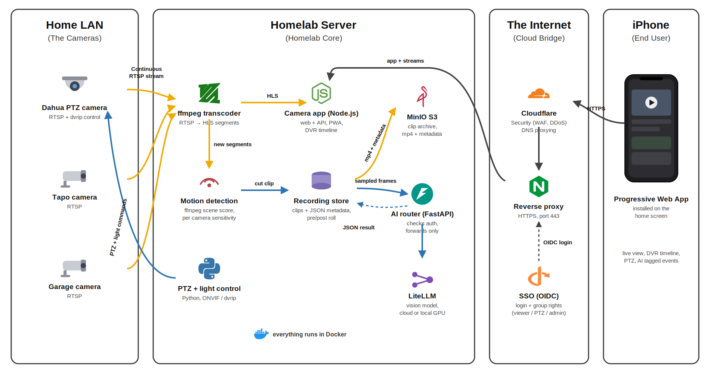

# Homelab camera

Self hosted camera viewer and NVR running on my homelab. Live view, DVR timeline, PTZ, motion detection and AI analysis of every clip, all in a PWA installed on my phone.

The code is private, this repo is just here to show how it works.

## Features

- Live HLS streaming of all cameras, with a low latency profile (~2s) and a balanced one
- DVR timeline to scrub back in time, with quality selection and retention pruning
- PTZ and white light control on cameras that support it
- Motion detection with per camera sensitivity, clips saved with pre and post roll
- Clips archived to S3 (MinIO) with their metadata
- AI analysis of each clip: category, label, confidence and a one sentence summary, shown in the event timeline
- SSO login, group based rights (viewer, PTZ, admin)
- Installable PWA with offline fallback

## Architecture

## How it works

### Live streaming

ffmpeg pulls the RTSP stream of each camera and writes HLS segments to disk. The PWA plays them with hls.js. Two profiles: low latency (1s segments) for live watching, balanced (2s) when the connection is worse. A separate DVR copy is kept for the timeline, pruned by retention settings so the disk does not fill up.

### Motion detection

Every 5 seconds the app runs ffmpeg scene detection on the newest HLS segment of each camera. No extra decode pipeline as the segments are already there. Sensitivity is per camera. A big global score means a day/night or exposure change, so it gets ignored instead of spamming clips. PTZ moves and light toggles also suppress detection for a few seconds.

When motion stops, the clip is cut from segments already on disk, with pre and post roll around the event. So recording a clip costs almost nothing.

### Archive and AI analysis

Each clip is uploaded to MinIO as mp4 plus a metadata JSON. Then the app samples a few frames from the clip and sends them to a small FastAPI router. The router does no real work: it checks the caller is allowed, then forwards the request to LiteLLM, which routes to a vision model (cloud or locally hosted, it goes through an internal platform I made which allows for easy routing between cloud and local models). The model answers with strict JSON: category (person, animal, vehicle, package, other, nothing), a short label, a confidence and a one sentence summary. That result is saved on the clip and shown in the event timeline.

Frame count, sampling mode and model are configurable from the UI without a restart.

### Auth

Login goes through my identity provider with OIDC. Groups decide what you can do: some accounts can only watch, some can move the cameras, some get the admin panel. Sessions are server side, the stream URLs are token protected for external players.

### PTZ

A Python script drives the cameras. It tries ONVIF first and falls back to dvrip, because some cheap cameras only answer on that protocol. Same script handles the white light (off, on, auto).

## Stack

Node.js + Express, ffmpeg, hls.js, Python (onvif, dvrip), FastAPI, LiteLLM, MinIO, Docker, Cloudflare + reverse proxy, OIDC SSO.
