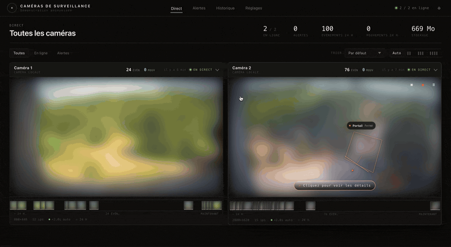
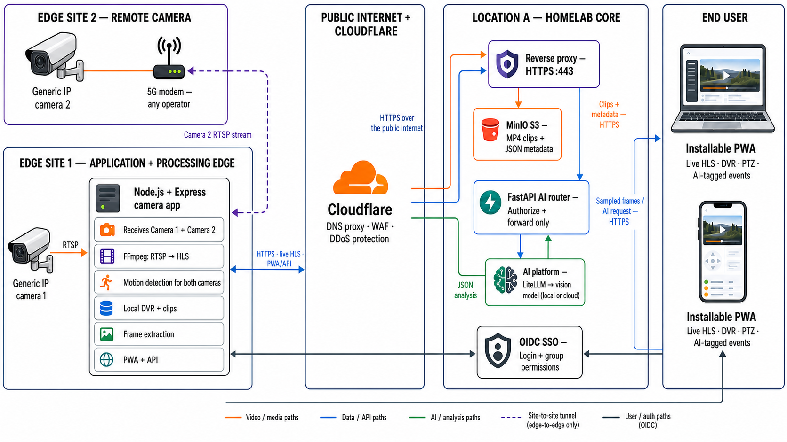
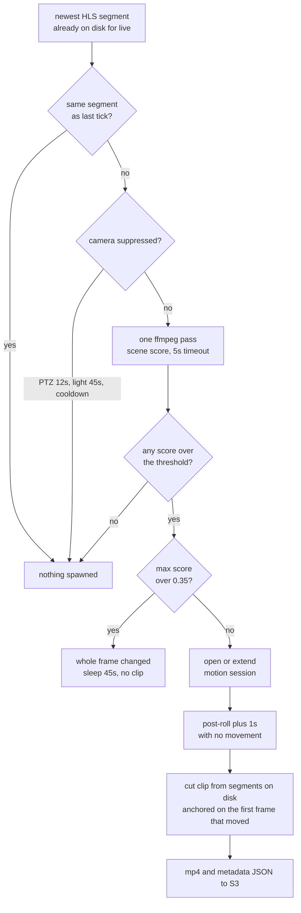
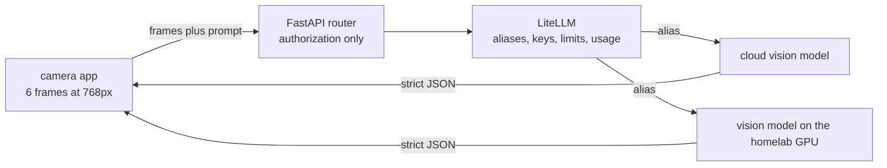

# Homelab camera

Self hosted camera viewer and NVR running on my homelab. Live view, DVR timeline, PTZ, motion detection and AI analysis of every clip, all in a PWA installed on my phone.

In daily use since May 2026. Two cameras across two sites, about 1200 clips and 10 GB of footage under retention, roughly 2s live latency. 181 commits, around 26k lines of app code with 70 test files.

## Demo



Live view of both cameras, then the camera page with its DVR timeline and gate history, the recorded events with clip playback, the alert dashboard with the AI analysis of a clip, and the settings. Sped up 2.4x. The app has a capture mode (`?anonymize=1`) that blurs the video, renames the cameras and hides network details, which is what you see here.

## Features

- Live HLS streaming of all cameras, with a low latency profile (~2s) and a balanced one
- DVR timeline to scrub back in time, with quality selection and retention pruning
- PTZ and white light control on cameras that support it
- Motion detection with per camera sensitivity, clips saved with pre and post roll
- Clips archived to S3 (MinIO) with their metadata
- AI analysis of each clip: category, label, confidence and a one sentence summary, shown in the event timeline
- SSO login, group based rights (viewer, PTZ, admin)
- Installable PWA with offline fallback

## Architecture



Two edge sites feed one homelab core. Camera 2 sends its RTSP stream through a site-to-site tunnel to Edge Site 1. The Node.js camera app at Edge Site 1 receives both cameras and performs all FFmpeg streaming, motion detection, recording and clip processing. Clips and AI requests then travel over the public internet through Cloudflare to the homelab core, where MinIO, the FastAPI AI router, LiteLLM and SSO run.

## How it works

### Live streaming

ffmpeg pulls the RTSP stream of each camera and writes HLS segments to disk. The PWA plays them with hls.js. Two profiles: low latency (1s segments) for live watching, balanced (2s) when the connection is worse. A separate DVR copy is kept for the timeline, pruned by retention settings so the disk does not fill up. Defaults are a 20 GB video quota and an 8 GB free disk floor, both editable from the UI.

### Motion detection

Every 5 seconds the app looks at the newest HLS segment of each camera and runs ffmpeg scene detection on it. The segments are already on disk for the live stream, so detection is one short ffmpeg call per camera and there is no second decode pipeline to feed. If the newest segment is the same one as last tick, nothing gets spawned at all.


```mermaid
flowchart TD
  seg["newest HLS segment<br/>already on disk for live"] --> seen{"same segment<br/>as last tick?"}
  seen -->|yes| skip["nothing spawned"]
  seen -->|no| sup{"camera suppressed?"}
  sup -->|"PTZ 12s, light 45s, cooldown"| skip
  sup -->|no| score["one ffmpeg pass<br/>scene score, 5s timeout"]
  score --> hit{"any score over<br/>the threshold?"}
  hit -->|no| skip
  hit -->|yes| glob{"max score<br/>over 0.35?"}
  glob -->|yes| night["whole frame changed<br/>sleep 45s, no clip"]
  glob -->|no| sess["open or extend<br/>motion session"]
  sess --> quiet["post-roll plus 1s<br/>with no movement"]
  quiet --> cut["cut clip from segments on disk<br/>anchored on the first frame that moved"]
  cut --> up["mp4 and metadata JSON to S3"]
```

Sensitivity is per camera, and it is not only a threshold. Each level also changes how the segment gets sampled, because a cat at the far end of a field and a car at the gate are not the same detection problem:

| Sensitivity | Scene threshold | Sampled at | Analysed at |
| --- | --- | --- | --- |
| tiny | 0.006 | 4 fps | 320 px wide |
| small | 0.014 | 3 fps | 240 px wide |
| medium | 0.035 | 2 fps | 160 px wide |
| large | 0.07 | 2 fps | 160 px wide |

Most of the work after that is deciding what to ignore. A scene score above 0.35 means the whole frame changed at once, which is a day/night switch or the IR light kicking in rather than something moving through the garden, so detection sleeps for 45 seconds instead of saving a clip nobody wants. Moving the camera or toggling its light suppresses it too, for 12 and 45 seconds, since a PTZ pan changes every pixel by definition.

Movement opens a session instead of firing a clip immediately. The session extends while things keep moving and closes one second after the post-roll runs out, because the segment holding the end of the event is only readable once it has been fully written. The clip is then cut from segments already on disk, anchored on the first frame that moved and stretched across the whole session. That way a slow walk up the drive is filmed from the start of the approach, not from wherever "fifteen seconds back from now" happened to land.

### Archive and AI analysis

Each clip goes to MinIO as an mp4 plus a metadata JSON. The app then samples a few frames from it (6 at 768px by default) and asks a vision model what happened.

The app never talks to a model provider. It posts to one internal OpenAI compatible endpoint, and that is the only AI address it knows about.


```mermaid
flowchart LR
  app["camera app<br/>6 frames at 768px"]
  router["FastAPI router<br/>authorization only"]
  llm["LiteLLM<br/>aliases, keys, limits, usage"]
  cloud["cloud vision model"]
  local["vision model on the homelab GPU"]
  app -->|"frames plus prompt"| router
  router --> llm
  llm -->|alias| cloud
  llm -->|alias| local
  cloud -->|"strict JSON"| app
  local -->|"strict JSON"| app
```

The router does almost nothing on purpose: it checks the caller is allowed, then forwards. Model choice, keys, rate limits and usage history all live in LiteLLM, which is part of a small AI platform I built for the homelab and share between projects. Swapping a cloud model for a locally hosted one is an alias change on that side, and the camera app does not move. Frame count, sampling mode and model are editable from the UI without a restart.

The clip URL rides along as request metadata so the platform can attribute usage. LiteLLM does not forward metadata to the model, so only the sampled frames ever reach it.

The model has to answer in this shape and nothing else. Free text fields come back in French, like the rest of the app:

```json
{
  "category": "person|animal|vehicle|package|state_change|crossing|object_removed|other|nothing",
  "eventType": "motion|crossing|state_change|presence|absence|object_removed|unusual|nothing",
  "label": "short label", "confidence": 0.0, "summary": "one factual sentence",
  "state": "open|closed|partly_open|present|absent|unknown",
  "previousState": "open|closed|partly_open|present|absent|unknown",
  "direction": "entrée|sortie|unknown",
  "counts": { "person": 0, "vehicle": 0, "animal": 0, "other": 0 },
  "animals": [{ "species": "from a fixed vocabulary", "count": 0, "confidence": 0.0 }],
  "unusual": false, "shouldNotify": true
}
```

The answer then gets checked rather than trusted, which is most of the code in that path:

- Species are restricted to a fixed vocabulary, so the model cannot name an animal the notification settings have no rule for.
- A claim of a person or a vehicle with nothing counted behind it is rewritten to `nothing`. That is a sentence about a dark patch of grass, not a detection.
- A missing confidence is not treated as a low confidence, because some models simply never fill the field.
- When the local tracker has already confirmed a line crossing from a stable trajectory, the prompt states it as fact and the model is not allowed to argue with the geometry.

### Auth

Login goes through my identity provider with OIDC. Groups decide what you can do: some accounts can only watch, some can move the cameras, some get the admin panel. Sessions are server side, the stream URLs are token protected for external players.

### PTZ

A Python script drives the cameras. It tries ONVIF first and falls back to dvrip, because some cheap cameras only answer on that protocol. Same script handles the white light (off, on, auto).

## Stack

Node.js + Express, ffmpeg, hls.js, Python (onvif, dvrip), FastAPI, LiteLLM, MinIO, Docker, Cloudflare + reverse proxy, OIDC SSO.

## About the code

The code is private and stays private. It is the software watching my own house, and publishing it next to a diagram of where the cameras sit and how the tunnels run is not a trade I want to make. This repo is the write-up instead.

Happy to walk through the real thing in a call, including the parts that are ugly.
