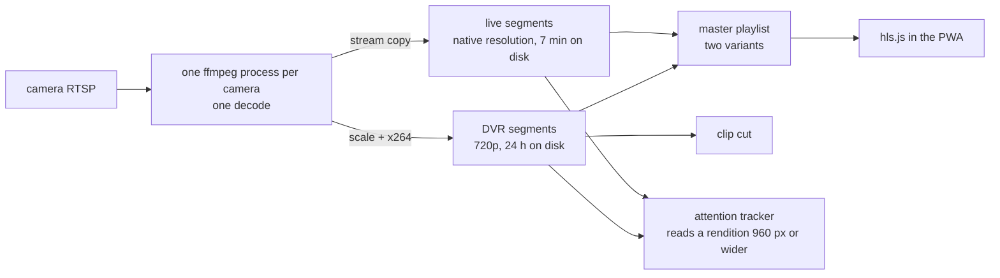
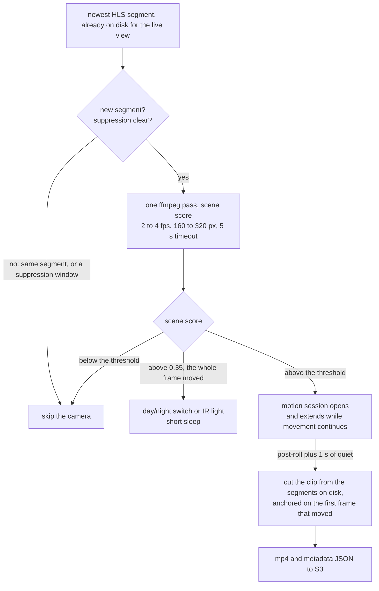

# Homelab camera

Self-hosted NVR and camera viewer. It streams two IP cameras and cuts a clip when something moves. It counts the people and vehicles that cross a drawn threshold, and sends every clip to a vision model. The client is an installable PWA.

The system went into production in May 2026 and runs every day. It watches my own property, so the numbers below come from the live deployment.

## Demo


The clip shows the live view of both cameras, then the camera page with its DVR timeline and gate history. It then shows the event history with clip playback, the alert page with the analysis of one clip, and the settings. Playback is 2.4x. The app has a capture mode (`?anonymize=1`) that blurs the video, renames the cameras and hides the network details.

## Production status

| Item | Value |
| --- | --- |
| Cameras | 2, on 2 sites |
| Live latency | about 2 s, with 1-second HLS segments |
| DVR depth | 24 h for each camera |
| Clips under retention | 922 |
| Disk in use | 31 GB: 17 GB of clips, 12 GB of HLS segments |
| Application code | about 49 000 lines |
| Tests | 105 files, about 18 000 lines |
| Commits | 275 |

## Architecture


Two edge sites feed one homelab core. Camera 2 sends its RTSP stream to edge site 1 through a site-to-site tunnel. The Node.js app at edge site 1 receives both cameras and does all the ffmpeg work: streams, detection, recordings and clip cuts. Clips and analysis requests then cross the public internet through Cloudflare to the homelab core. The core runs MinIO, a FastAPI router, LiteLLM and the identity provider.

Both edge hosts are 6-core Intel CPUs with no GPU. Every model in the detection path runs on the CPU.

## Video pipeline

One ffmpeg process serves each camera. It decodes the RTSP feed one time and writes two HLS renditions.


```mermaid
flowchart LR
  cam["camera RTSP"] --> ff["one ffmpeg process per camera<br/>one decode"]
  ff -->|"stream copy"| live["live segments<br/>native resolution, 7 min on disk"]
  ff -->|"scale + x264"| dvr["DVR segments<br/>720p, 24 h on disk"]
  live --> master["master playlist<br/>two variants"]
  dvr --> master
  master --> player["hls.js in the PWA"]
  dvr --> clip["clip cut"]
  live --> track["attention tracker<br/>reads a rendition 960 px or wider"]
  dvr --> track
```

The live rendition is a stream copy. It keeps the original picture and costs almost no CPU. The DVR rendition is the only encode, and its height is a user setting. The player reads the master playlist and selects the native copy for quality, or the DVR rendition on a weak connection. Both playlists carry `EXT-X-PROGRAM-DATE-TIME` on every segment, so any segment maps directly to the wall clock.

Segment duration controls the disk cost more than the encoder quality does. Each segment must start on a keyframe, and at 720p the keyframes are most of the archive. Measured on the 2880x1620 scene:

| DVR configuration | GB/day |
| --- | --- |
| 720p, 1 s segments, `-tune zerolatency` | 58.9 |
| 720p, 1 s segments | 49.1 |
| 720p, 1 s segments, CRF 34 | 17.4 |
| **720p, 2 s segments (current)** | **14.0** |
| 720p, 4 s segments | 9.4 |

Two-second segments cost a third of the disk at the same picture quality. A CRF change buys the same saving with quality. `-tune zerolatency` suits a live view. In an archive it removes lookahead, B-frames and mb-tree, doubles the size and costs more CPU.

## Motion detection

Every 5 seconds the app reads the newest live segment of each camera and runs one ffmpeg scene-score pass on it. The segments are already on disk for the live view, so detection costs one short ffmpeg call for each camera. If the newest segment is the segment of the last tick, the app skips that camera.


```mermaid
flowchart TD
  seg["newest HLS segment, already on disk for the live view"] --> gate{"new segment?<br/>suppression clear?"}
  gate -->|"no: same segment, or a suppression window"| skip["skip the camera"]
  gate -->|yes| score["one ffmpeg pass, scene score<br/>2 to 4 fps, 160 to 320 px, 5 s timeout"]
  score --> verdict{"scene score"}
  verdict -->|"below the threshold"| skip
  verdict -->|"above 0.35, the whole frame moved"| night["day/night switch or IR light<br/>short sleep"]
  verdict -->|"above the threshold"| sess["motion session opens<br/>and extends while movement continues"]
  sess -->|"post-roll plus 1 s of quiet"| cut["cut the clip from the segments on disk,<br/>anchored on the first frame that moved"]
  cut --> s3["mp4 and metadata JSON to S3"]
```

Sensitivity is a per-camera setting. Each level sets a threshold and a sampling rate together. A cat at the far end of a field and a car at a gate are different detection problems.

| Sensitivity | Scene threshold | Sampled at | Analysed at |
| --- | --- | --- | --- |
| tiny | 0.006 | 4 fps | 320 px wide |
| small | 0.014 | 3 fps | 240 px wide |
| medium | 0.035 | 2 fps | 160 px wide |
| large | 0.07 | 2 fps | 160 px wide |

Most of the remaining logic decides what to ignore. A scene score above 0.35 means that the whole frame changed at one time. That is a day/night switch or the IR light. A subject in the garden changes a small part of the frame. Detection then sleeps for a few seconds and lets the segment pass. A PTZ move and a light change suppress detection for a few seconds too, because a pan changes every pixel.

Movement opens a session. The session extends while movement continues. It closes one second after the post-roll, because the segment that holds the end of the event is only readable when complete. The app then cuts the clip from the segments on disk, anchored on the first frame that moved and stretched over the whole session. The clip therefore holds a slow walk up the drive from the start of the approach.

## Attention zones

A motion clip says that something moved. An attention zone answers three separate questions, and the system keeps the three answers independent. A shadow causes movement in the picture. The state and the crossing count stay the same.

1. Where is the watched object after the camera moves?
2. What is its physical state, for example a gate open or closed?
3. Who crossed the threshold, in which direction, and how many were there?

### Geometry

The operator draws a polygon over the object. ORB features and a RANSAC homography re-register that polygon after a PTZ move. Each edit carries a `geometryRevision`. On save the new shape becomes the truth at once, and the app removes the anchors that hold the old coordinates. Before that rule, the old polygon came back on the next re-registration.

### State

A tight crop of the object feeds the state read. The tracker sends the last three observations, so three frames decide the state together. When certified open and closed examples exist, the app sends one recent example of each before the current frames. The app accepts a high-confidence read on three frames at once, and weaker reads must repeat. The last reliable state expires after five minutes.

### Crossings

Geometry answers the third question. The threshold is a separate two-point line, and the operator draws it by hand. The same gate serves both directions, and only a line carries a direction that a user can read.

- Ultralytics YOLO detects people, vehicles and the six animals that COCO can name and this property holds.
- BoT-SORT holds a numeric identity across frames **and across HLS segment boundaries**. The Python worker stays alive for this reason: it takes one JSON job per line on stdin and keeps its identities between jobs.
- Supervision `LineZone` receives those identities and the bottom-centre of each box, which is the contact point with the ground. In a high-angle view the head can stay on one side of the line while the feet are already across.
- `LineZone` needs three confirmed frames on the far side before it reports a crossing. The line has a finite length, so a pedestrian far from the gate counts zero.
- The detector reads 5 frames per second (`vid_stride=3` on a 15 fps camera). BoT-SORT holds the identity between those frames.

One trip past the line produces one passage. A shake, a shadow or an object that stays on one side produces zero passages. The final counts come only from the tracked identities that crossed the threshold. The vision model describes the scene, and the geometry sets the number.

### The tick loop

```
every 850 ms, for each camera:

  select the oldest un-inspected segment
     |
     +-- attention_tracker.py         motion, zone fit, gate state       ~320 ms
     +-- attention_object_tracker.py  YOLO + BoT-SORT crossings          ~450 ms/s
                                      (only when a zone has a crossing rule)
```

Both workers run in parallel, so a tick costs the slower of the two. The app starts the object tracker only for a camera that has a crossing rule.

The object tracker letterboxes each frame to 960 px on the long side. Any rendition 960 px or wider therefore gives it the same input. The 720p DVR rendition is 1280 px wide, so the tracker reads it and decodes fewer pixels: 745 ms per 2-second segment against 1204 ms on the native 2880x1620 copy.

Every event carries the **segment** time, because an event belongs to the moment it was filmed. The tracker consumes segments oldest first, so a stall replays the footage. That order has a floor of 90 seconds. Past that floor the tracker rejoins at the live edge and writes a `tracker_backlog` span.

## Clip analysis

Each clip goes to MinIO as an mp4 and a metadata JSON. The app then samples frames from it, 6 frames at 768 px by default, and asks a vision model what happened. The app posts to one internal OpenAI-compatible endpoint. That endpoint is the only AI address it holds.


```mermaid
flowchart LR
  app["camera app<br/>6 frames at 768 px"]
  router["FastAPI router<br/>authorization only"]
  llm["LiteLLM<br/>aliases, keys, limits, usage"]
  cloud["cloud vision model"]
  local["vision model on the homelab GPU"]
  app -->|"frames and prompt"| router
  router --> llm
  llm -->|alias| cloud
  llm -->|alias| local
  cloud -->|"strict JSON"| app
  local -->|"strict JSON"| app
```

The router does very little on purpose: it authorizes the caller, then forwards. Model choice, keys, rate limits and usage history live in LiteLLM. LiteLLM belongs to a small AI platform I built for the homelab and share between projects. To replace a cloud model with a local one I change an alias on that side. The camera app stays as it is. Frame count, sampling mode and model are UI settings and need no restart.

The model must answer in this shape. Free-text fields come back in French, like the rest of the app:

```json
{
  "category": "person|animal|vehicle|package|state_change|crossing|object_removed|other|nothing",
  "eventType": "motion|crossing|state_change|presence|absence|object_removed|unusual|nothing",
  "label": "short label", "confidence": 0.0, "summary": "one factual sentence",
  "state": "open|closed|partly_open|present|absent|unknown",
  "previousState": "open|closed|partly_open|present|absent|unknown",
  "direction": "entrée|sortie|unknown",
  "counts": { "person": 0, "vehicle": 0, "animal": 0, "other": 0 },
  "animals": [{ "species": "from a fixed vocabulary", "count": 0, "confidence": 0.0 }],
  "unusual": false, "shouldNotify": true
}
```

The app checks that answer before it stores it. Those checks are most of the code on this path:

- The species vocabulary is fixed, and the prompt quotes it from the same list the notification settings render. The model can name only an animal that has a notification rule.
- An animal below 0.6 confidence is a guess about a dark shape. That threshold exists because such guesses filled one camera history with animals that were branches.
- When the tracker already confirmed a crossing from a stable trajectory, the prompt states it as a fact. The geometry keeps authority over the answer. The app strips the words `crossing`, `entrée` and `sortie` from the label and the summary when a trajectory is absent.
- DVR windows can overlap. Two clips of the same threshold, direction and crossing instant within 8 seconds both stay readable. The second carries `duplicateOf`: the app sends one notification, and counts its people one time.
- A reasoning model can end its budget before it emits the JSON. The app retries an empty or malformed answer exactly one time, and a genuine `unknown` stays valid.

## Alerts, reports and export

Web Push carries the alerts, with VAPID keys the server generates on first start. A subscription is per user and per camera, and the user chooses which alert kinds and which animal species may raise a notification.

The live page carries a recap panel: current state, confirmed passages, counts per subject kind over 24 hours, and a reversible filter that drives the event log and the timeline together. The app derives every number there from the stored analysis. `ruleType` names the rule that fired, and the motion rule fires first, so most real passages become crossings when the clip analysis lands.

Two read-only interfaces sit on the same store. A service-key `/internal` API serves the homelab AI platform, which builds a daily surveillance report. That layer resolves the event kind one time, so the platform reads one settled answer. An `/api/export` API streams NDJSON to a datalake over half-open `[from, to)` ranges, in timestamp then id order. A re-read of a range therefore gives the same answer twice.

The export carries what analytics needs: event times, kinds and counts. Zone geometry and media stay inside the app, and `createdBy` becomes a per-deployment HMAC pseudonym.

## Access and camera control

Login goes through my identity provider with OIDC, and sessions are server-side. Three roles (viewer, controller and admin) carry independent rights: history, rewind, audio, camera controls, recording, alerts and zone editing. Rights can be narrowed per camera. Alert reading and zone editing are separate rights on purpose. A viewer reads what the property saw, and the map of the property stays with the admin.

The S3 bucket stays private, and a raw object URL answers `AccessDenied`. Playback goes through a route that checks the session and the camera rights. The route reads the object with the service identity, supports HTTP `Range`, and keeps the S3 key and the object URL private. External players get a token-protected `/live/channels.m3u`.

A Python script drives the cameras and the white light. It tries ONVIF first and falls back to dvrip, because some cheap cameras answer only on that protocol.

## Client

Vanilla JavaScript, no framework and no build step: 13 500 lines in the viewer plus ten small modules the tests import directly. A service worker caches the app shell and serves an offline page, while the API, the streams and the recordings stay network-only. The UI has a dark theme and a light theme. Anything drawn over the picture uses a separate palette, so it stays readable on both. The start path is ordered by need: `/api/status` first, then the cameras and HLS, then the zones, and the heavy history response last.

## Stack and deployment

Node.js 22 and Express, ffmpeg, hls.js, Python (OpenCV, Ultralytics YOLO, BoT-SORT, Supervision, ONVIF, dvrip), FastAPI, LiteLLM, MinIO, Docker, Cloudflare and a reverse proxy, OIDC SSO.

The image installs torch from the CPU wheel index before anything that depends on it. The default index serves a CUDA build. It put 3.4 GB of `nvidia/` and `triton` into an image on a host with no GPU. The CPU index takes the image from 10.4 GB to about 7 GB. The build exports the YOLO model to OpenVINO at 960 px, and the worker falls back to PyTorch if OpenVINO inference fails. Saved-clip replay can run on a second host, over an SSH pipe through the Cloudflare tunnel: the deployment mounts the key, the SSH config and `cloudflared` at run time, so the image holds no credential.

## Tests

105 test files, about 18 000 lines: `node:test` for the JavaScript and `unittest` for the Python, plus a syntax check over every file that ships. Real footage validates detection. A replay reads the archived MP4 files from S3 and scores the pipeline on the actual pixels. The first version of that ground-truth manifest attributed a trajectory to the wrong clip and inverted the two directions, so it reported a false 7/7. Scores now come from the replay of the media.

## The code is private

This repository holds the write-up, the architecture diagram and the demo. The application code stays closed.

The reason is the function of the software: it watches my house. A public repository next to a diagram of the camera positions and the tunnel routes hands over the map and the implementation together. Closed source sits on top of the real defences. After 275 commits and 105 test files I would rather you read it.

The demo runs against the real deployment. Happy to walk through the real thing in a call, including the parts that are ugly.
